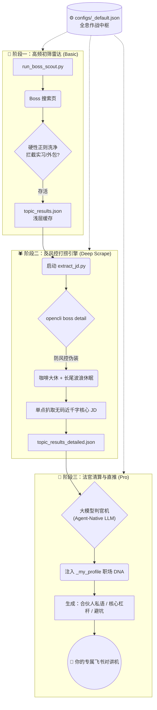

# 🦅 DestinyScout: AI 个性化猎头系统 V1.0

<div align="center">
  <p><strong>一个基于 Agent-Native LLM 的 L3 级自主求职推荐引擎</strong></p>
  <p>告别毫无灵魂的机械搬运 —— 深度注入你的职场 DNA，让 AI 引擎跨越喧嚣的茫茫人海，为你精准共鸣那个“命中注定”的理想归宿。</p>
</div>

---

## 🌟 核心愿景 (Vision)

传统的爬虫只能搬运冷冰冰的数据，它不懂你的野心，也不懂你的底线。  
**Boss Job Scout V3.1** 不是一个简单的脚本，它是你的**全自动私人 AI 猎头战车**。系统通过仿生学雷达无缝穿透风控，强行扒取近千字完整 JD，最后利用 Agent 原生大模型结合你的「重度个人画像」，实施千人千面的毒辣审判，并向你的飞书推送一剑封喉的岗位简报。

这套系统被评定为 **Level 3 级自主化 Agent**，具备极高的抗并发能力与深度思考能力。

---

## 💎 史诗级核心亮点

- ⚡️ **全息化终端向导 (Init Wizard)**: 告别繁琐的手写 JSON 配置。跑一下启动脚本，在带有绚丽 ANSI 色的 `Rich` 终端里交互式构建你的专属雷达基站。
- 🕷️ **四维深潜反风控 (Deep Scrape Engine)**: 内置“大波浪随机抖动”与“连续作战咖啡休眠局”，彻底伪装人类求职行为，成功扒取最深层的 JD 暗网数据。
- 🧠 **大模型判官机 (Agent-Native LLM Judges)**: 你的脱敏简历和职业雷区会被浓缩成最高权重的 System Prompt。遇到画大饼的公司？大模型会在推片日志里毫不留情地为你揭穿。
- 🚀 **极速对讲机直推**: 脱水后的高纯度合伙人点评、核心杠杆、潜在避坑点，通过飞书机器人直接触达你的手机。

---

## 🗺️ V3.1 系统编排全景图



---

## 📋 快速入列指南

### 1. 前置条件武装
- [Node.js](https://nodejs.org/) v18+ 
- [opencli](https://github.com/jackwener/opencli) 全局安装 (`npm install -g @jackwener/opencli`)，并配好 Chrome 插件处于 [BOSS直聘](https://www.zhipin.com/) 的登录态。
- 已配置 `lark-cli`（用于飞书落库与推送）。

### 2. ⚡️ Step 0: 唤醒并注入你的 DNA（必做！）
在克隆本项目后，**你必须首先激活全局作战配置终端**：

```bash
python3 ~/.gemini/antigravity/skills/boss-job-scout/scripts/boss_scout_init.py
```
*(如果你的 Python 环境缺少渲染库，系统会静默自愈安装 `rich` 与 `questionary`)*
在绚丽的控制台里：
1. **输入基础坐标**（你想拿几 K？向往哪座城？想要几年底线？）
2. **上传脱敏履历**，构建专属的强心智画像。

### 3. ⚔️ 常规战斗序列 
配置完毕后，每天只需按序扣动以下三个扳机（也可挂载入系统 crontab）：

```bash
# 阶段1：泛扫盲（拉网式初探浅层看板）
python3 scripts/run_boss_scout.py

# 阶段2：高频穿戴装甲（启动深海防封萃取，潜行提取全量 JD）
python3 scripts/extract_jd.py

# 阶段3：降维打击推送（呼叫大模型结合 DNA 斩杀烂岗位，并送达飞书）
python3 scripts/push_top5_v3.py
```

---

## ⚠️ 紧急救灾手册（遭遇封堵）

当你在终端看到 `Network Error` 疯狂报错时，**不要慌，你的账号大概率没有被封禁**。这通常是因为 `opencli` 的隐身探针与你手动登录的浏览器 Session 发生了时空断裂（影子替身局）。

**一键满血复活方案：**
1. 确保电脑里只开着**唯一一个**装了插件的 Chrome 窗口。
2. 新开一个 Tab，明确输入并访问一遍 `https://www.zhipin.com/web/geek/job`。
3. 随意点击几下确认页面响应活泼（不要关掉这个 Tab，留置后台）。
4. 切回终端重新执行脚本，装甲车即可再次轰鸣启动！

---

## 🔮 Roadmap 进化与后续全景

- [ ] **高维对话记忆体 (Latent Intent Memory)**：在下个大版本，系统将加入长期记忆机制。它能根据你每一天在向端的互动点评反馈（如“这个技术栈太老我绝不去”），自动并永久修正你的隐藏意图，它将比你自己更懂你。
- [ ] **多端协同触达**：未来支持更多通知端生态融合。

## 📄 License
MIT
